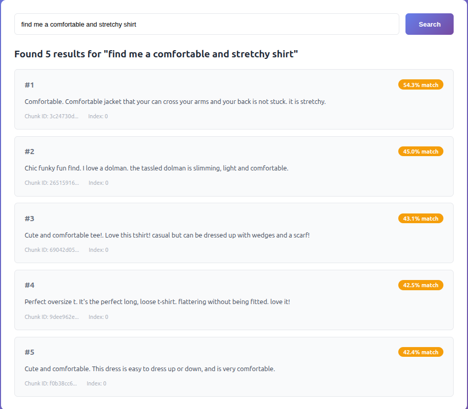
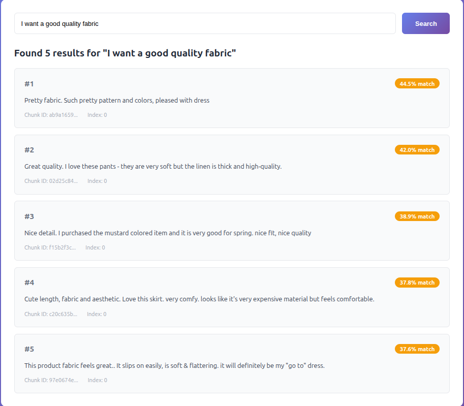

## 1. Dataset Selection

Dataset: Women’s Clothing E-Commerce Reviews

Source: Kaggle — https://www.kaggle.com/datasets/nicapotato/womens-ecommerce-clothing-reviews

Original size: 23,486 reviews
Final size after my processing: 170 reviews, ~21.6k characters, 9 columns

I picked this dataset because works great for demonstrating semantic search because the reviews are short, focused, and describe real shopping experiences (After i processed it) .it was else very easy to adapt to the assignment requirements, and I also used it years ago when I started learning data science 

**Data Processing**

I wanted the dataset to be small and clean so the retrieval results would be meaningful, not noisy.
What I did:

* Removed non-textual/numerical columns (Clothing ID, Rating, Recommended IND)
* Kept only reviews with a title
* Filtered reviews to under 100 characters to keep the text focused
* Added age-group categories
* Randomly sampled 170 rows as the final dataset

Questions i would ecpect:
* "Find me a comfortable and stretchy shirt"
* "I want a good quality fabric"
* "special occasion dress"
* "worth the price"
* "I want to see poor quality pents"
* "disappointing purchase"
* "cute and trendy shirt"

------------------------------------------------------------------------------------v

## 2. Vector Database Selection

I chose ChromaDB

* Works locally, no servers or API keys. Perfect for a small project.
* Free
* Very simple to use - easy Python API, a few lines of code to get started.
* My dataset has low amount of chunks, so Chroma handles it instantly.

------------------------------------------------------------------------------------v

**Parameters**:

* Chunk size: 250 characters - average review is 100 chars → most reviews = 1-3 chunks
* Overlap: 50 characters (20%) - overlap prevents context loss at boundaries
* top_k: 5 - Returns 5 most similar chunks
* similarity_threshold: 0.35 - Tuned through testing to balance precision/recall

------------------------------------------------------------------------------------v

**Services**:

* ChunkingService - splits long text into smaller, overlapping pieces
* EmbeddingService - converts text into vector numbers using OpenAI API
* VectorStore - stores embeddings in ChromaDB and searches them
* RetrievalService - coordinates all the other services

------------------------------------------------------------------------------------v

